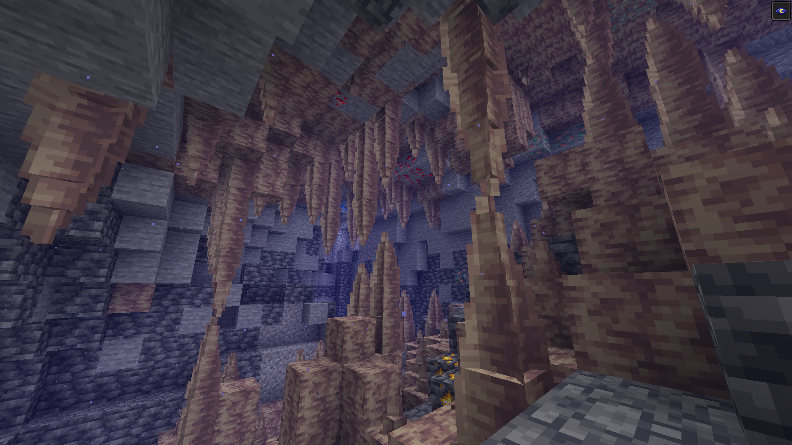

  

# 📖 About

**Blocky Dripstone** is a small Resource Pack that makes Pointy Dripstone more blocky by simply adding one (1) more cube to every model.

The performance impact of this is negligible, as it only increases the number of cubes rendered per Pointy Dripstone by 50%.

# 🛠️ Usage

Install the Resource Pack by downloading the latest release from **Modrinth** or **Github**, placing it in your Resource Packs folder, and selecting it in-game.

The Resource Pack should be compatible with all versions of Minecraft from **1.17** onwards.

# 🖼️ Images

*The Resource Pack in action*

*How Pointed Dripstone looks in vanilla*

More Images
 

*Underground cliff*

*No escape*

*I'm gonna eat'cha!*

*Ouch! Spiky!*

# 🪪 License

This project is licensed under [CC BY-SA 4.0](https://creativecommons.org/licenses/by-sa/4.0/), which means that you are allowed to use it in your own project so long as you share your work under the same license.